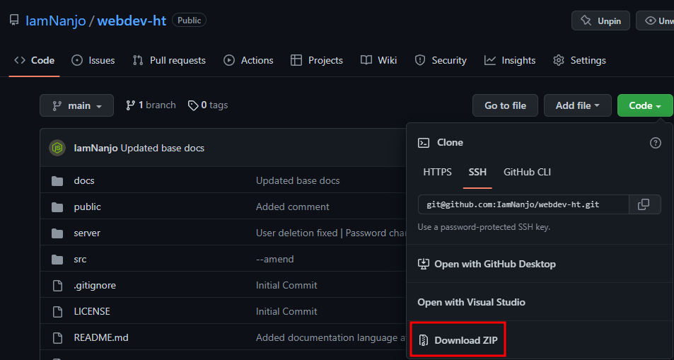

# WhatUpp

Ensimmäinen versio: 11.8.2022

Viimeksi päivitetty: 12.8.2022

## Yleiskatsaus

Harjoitustyö kursseille web-ohjelmointi TTMS0500-3007 ja web-palvelinohjelmointi TTMS0900-3007.

Harjoitustyön tekijä on Arttu Kaipainen ja sen aiheena on WhatUpp full-stack PWA viestintäsovellus,
jolla voi lähettää yksityisviestejä ja ryhmäviestejä.
Sen toteutukseen on käytetty MERN-stackiä eli:

-   MongoDB
-   ExpressJS
-   React
-   NodeJS

Sivun yläreunassa on linkki GitHub repositorioon, josta löytyy kaikki harjoitustyön lähdekoodit.
Sieltä voi myös ladata kaiken lähdekoodin zip-tiedostona ja käyttää ohjelmaa vapaasti miten vain haluaa. ([Unlicense](https://unlicense.org/) lisenssi)

[Zip-tiedoston suora latauslinkki](https://github.com/IamNanjo/webdev-ht/archive/refs/heads/main.zip)



Vaikka koodin muuttujat ja funktiot on hyvin nimetty ja koodi on kommentoitu, selitän tärkeimpien funktioiden ja reittien toimintaa dokumentaation Back-end ja Front-end osioissa.

Repositorion README.md tiedostossa on selitetty kansiorakenne.

Kokeiluympäristö löytyy [täältä](https://webdev-ht.nanjo.tech/)

## Reitit ja komponentit

Ohjelmassa on 5 reittiä ja jokainen niistä käyttää NavBar.jsx komponenttia:

Kaikki reitit vaativat kirjautumisen, paitsi kirjautumis- ja rekisteröitymisreitit

-   /login (Login.jsx)
-   /register (Register.jsx)
-   /profile (Profile.jsx)
-   /messages (ChatView.jsx)
-   /logout (NavBar.jsx tunnistaa reitin muutoksen ja kirjautuu ulos)

```javascript
<Router>
	<NavBar />
	<Routes>
		<Route path="/auth/register" element={<Register />} />

		<Route path="/auth/login" element={<Login />} />

		<Route path="/profile" element={<Profile />} />

		<Route path="/messages" element={<ChatView />} />
	</Routes>
</Router>
```

Näiden lisäksi on myös muutama API reitti, joissa ei ole näkymää:

-   /api/profile (GET: Oman käyttäjän ID:n ja nimen hakeminen)
-   /api/users?searchWord (GET: Muiden käyttäjien hakeminen käyttäjänimen avulla)
-   /api/chats
    -   GET: Omien keskusteluiden ja viestien hakeminen
    -   POST: Uuden keskustelun luominen
    -   DELETE: keskustelun poistaminen
-   /api/messages (POST: Viestin luominen (lähettäminen))

## Itsearviointi

Olen erittäin tyytyväinen harjoitustyön ohjelmaan ja siitä tuli melko pitkälti sellainen kuin halusin, vaikka käyttöliittymään olisi voinut vielä tehdä pientä hienosäätöä.

Harjoitustyö on laaja, se toimii hyvin ja käyttöliittymä on helppokäyttöinen, mutta dokumentaatio voisi olla parempi enkä aio esitellä harjoitustyötä, joten ehdotan arvosanaa 4.

Ajan käyttö:

-   Back-end n. 25 tuntia
-   Front-end n. 30 tuntia
-   Dokumentaatio n. x tuntia
-   Yht. 60 tuntia
